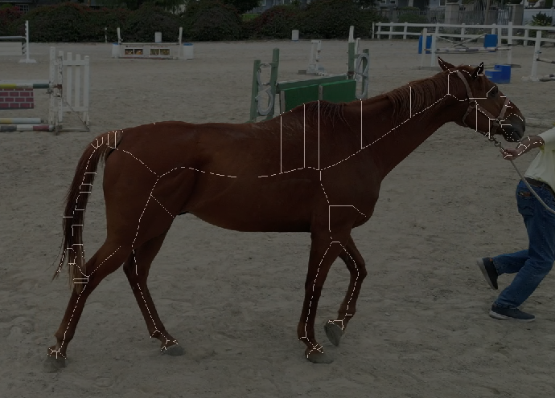
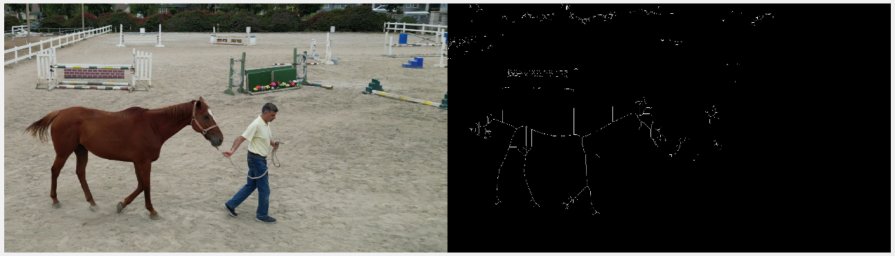
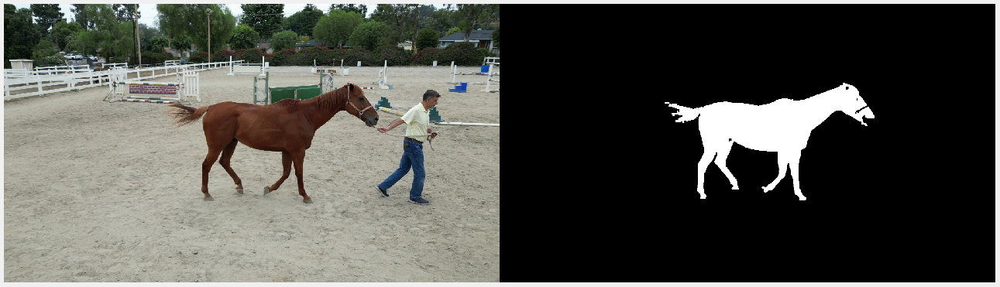

# This Section of the Repository is for the IMU PROJECT - Vision section

This Repo will contains the development of the Computer Vision Aspect of this project

Before Blob Analysis:

After Blob Analysis:

Notice that before the blob analysis, we encounter a lot of noise, since the color difference method is not perfect in essence (it will also read some other colors that the image/video contains, so not everything is isolated). The blob analysis will analyze the image/video and will eliminate "smaller blobs", such that we have an isolated image of the bigger blobs since we tailored our color masking to the color of the horse itself. 

Our current progress is located at:
[Horse 3](../vision/latestDev/horse_test3.m)

Current Mask:
[Mask 6](../vision/latestDev/createMask6.m)

For more information of the MATLAB functions that are being used, please check the links below\
================================================================

Information in regards of the MATLAB function being used for this project, their brief description, and help link to matlab help in alphabetical order:

- [bwlabel](https://www.mathworks.com/help/images/ref/bwlabel.html) - Label connected components in 2-D binary image
- [bwmorph](https://www.mathworks.com/help/images/ref/bwmorph.html) - Morphological operations on binary image
- [close](https://www.mathworks.com/help/matlab/ref/videowriter.close.html?searchHighlight=close&s_tid=srchtitle_support_results_3_close) - Close file / figures
- [hasFrame](https://www.mathworks.com/help/matlab/ref/videoreader.hasframe.html?searchHighlight=hasframe&s_tid=srchtitle_support_results_1_hasframe) - Determine if video frame is available to read
- [im2uint8](https://www.mathworks.com/help/images/ref/im2uint8.html?searchHighlight=im2uint8&s_tid=srchtitle_support_results_1_im2uint8) - Convert image to 8-bit unsigned integers
- [imclose](https://www.mathworks.com/help/images/ref/imclose.html?searchHighlight=imclose&s_tid=srchtitle_support_results_1_imclose) - Morphologically close image
- [imopen](https://www.mathworks.com/help/images/ref/imopen.html?searchHighlight=imopen&s_tid=srchtitle_support_results_1_imopen) - Morphologically open image
- [imshowpair](https://www.mathworks.com/help/images/ref/imshowpair.html?s_tid=doc_ta) - Compare differences between images
- [ismember](https://www.mathworks.com/help/matlab/ref/double.ismember.html?searchHighlight=ismember&s_tid=srchtitle_support_results_1_ismember) - Array elements that are members of set array
- [max](https://www.mathworks.com/help/matlab/ref/max.html?searchHighlight=max&s_tid=srchtitle_support_results_1_max) - Maximum element of array
- [open](https://www.mathworks.com/help/matlab/ref/videowriter.open.html?searchHighlight=open&s_tid=srchtitle_support_results_2_open) - Open file for writing video data
- [pause](https://www.mathworks.com/help/matlab/ref/pause.html?s_tid=doc_ta) - Stop MATLAB execution temporaily
- [readFrame](https://www.mathworks.com/help/matlab/ref/videoreader.readframe.html?s_tid=doc_ta) - Read next video frame
- [regionprops](https://www.mathworks.com/help/images/ref/regionprops.html?s_tid=doc_ta) - Measure properties of image regions
- [strel](https://www.mathworks.com/help/images/ref/strel.html?searchHighlight=strel&s_tid=srchtitle_support_results_1_strel) - Morphological structuring element; essential part of morphological dilation and erosion operation
- [writevideo](https://www.mathworks.com/help/matlab/ref/videowriter.writevideo.html?searchHighlight=writevideo&s_tid=srchtitle_support_results_1_writevideo) - Write video data to file
- [VideoReader](https://www.mathworks.com/help/matlab/ref/videoreader.html?s_tid=doc_ta) - Create an object to read video files
- [VideoWriter](https://www.mathworks.com/help/matlab/ref/videowriter.html?s_tid=doc_ta) - Create an object to write video files

================================================================

- [Morphological Operations](https://www.mathworks.com/help/images/morphological-filtering.html)

Morphology is a broad set of image processing operations that process images based on shapes. In a morphological operation, each pixel in the image is adjusted based on the value of other pixels in its neighborhood. By choosing the size and shape of the neighborhood, you can construct a morphological operation that is sensitive to specific shapes in the input image.

================================================================

Improvements and Targets:\
**Done:**\
[&check;] Better color masking\
[&check;] Blob Analysis to minimize other objects\

**Failed:**\
[&cross;] Minimize the missing hoof masking (less mask perhaps)\
❗**Reason:** We tried to apply different masks from the other videos that we have, but seems like the best mask is the mask from video6, hence we called the mask createMask6.

[&cross;] Cleaner skeleton with only main line showings\
❗**Reason:** We tried to clean the middle section of the skeleton so it will only contain "longer" lines, but apparently the center lines consisted of dashed lines, such that it will be impossible to create one long lines. I tried a different method to create longer lines (to combine the lines in the torso part of the horse) and it created a wrong output (undesired result).

**Ongoing:**\
[&emsp;] Overlay the skeleton with lines to have a thicker and better skeletons\
[&emsp;] Writing the video output as a file for ease of use

================================================================

Notes:
- This project is based on [Image Processing Toolbox](https://www.mathworks.com/products/image.html) on MATLAB. In order to make this project to work properly, you would need to download the Image Processing Toolbox from MATLAB and install it on your computer.

